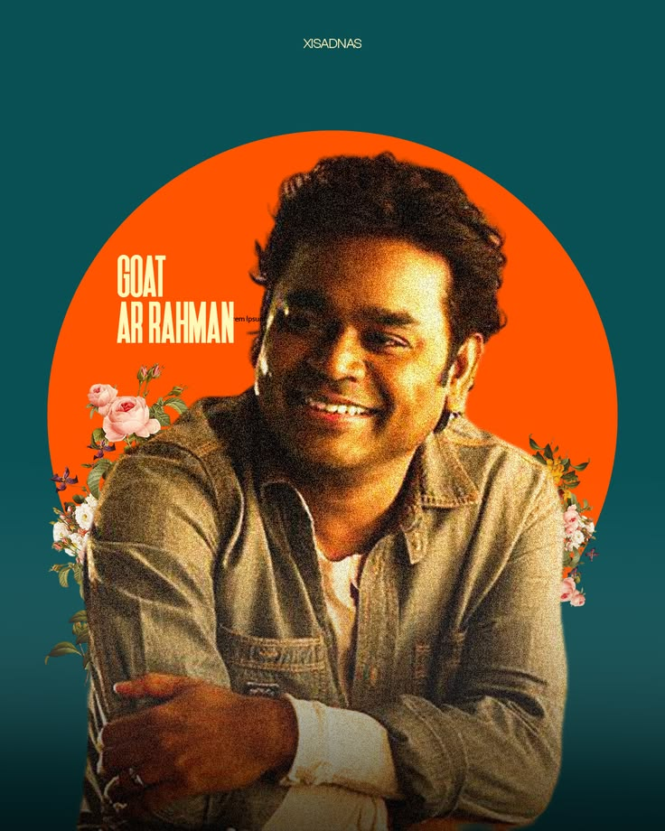
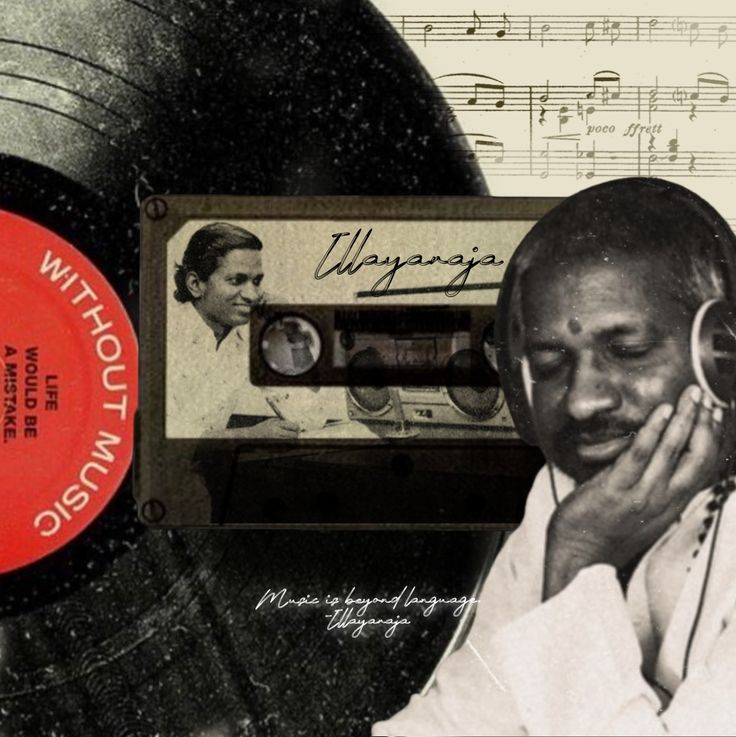
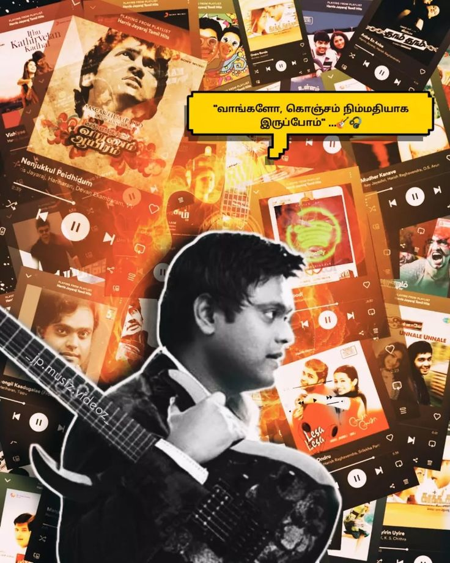
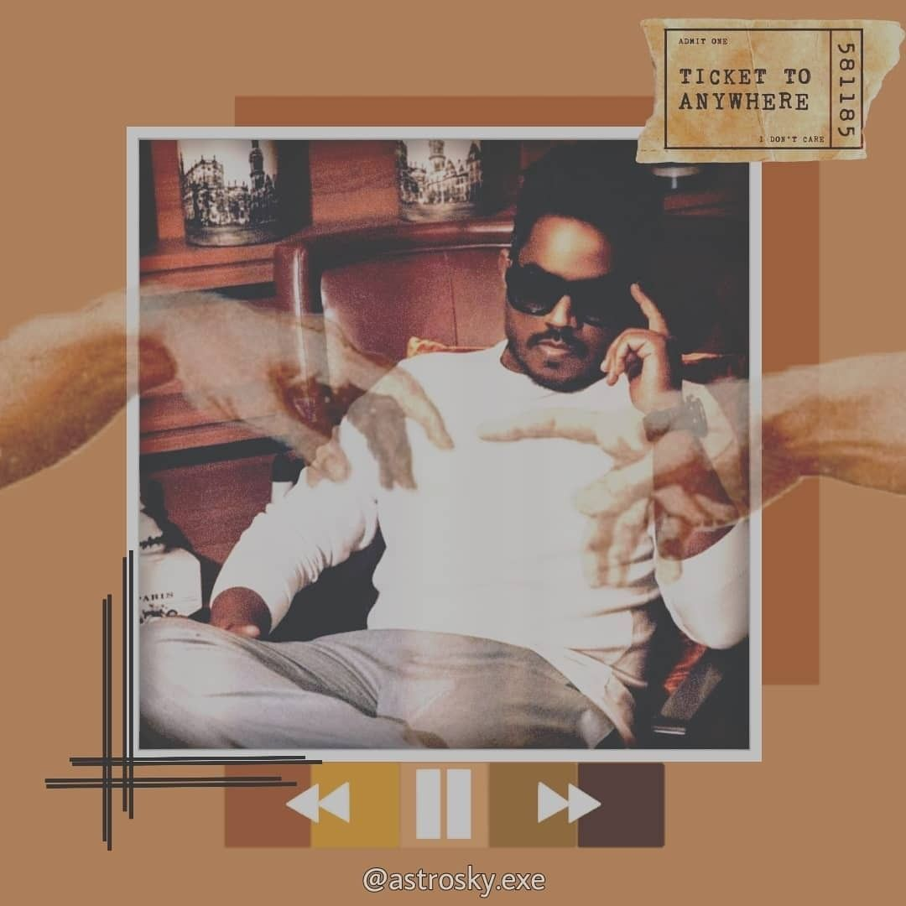
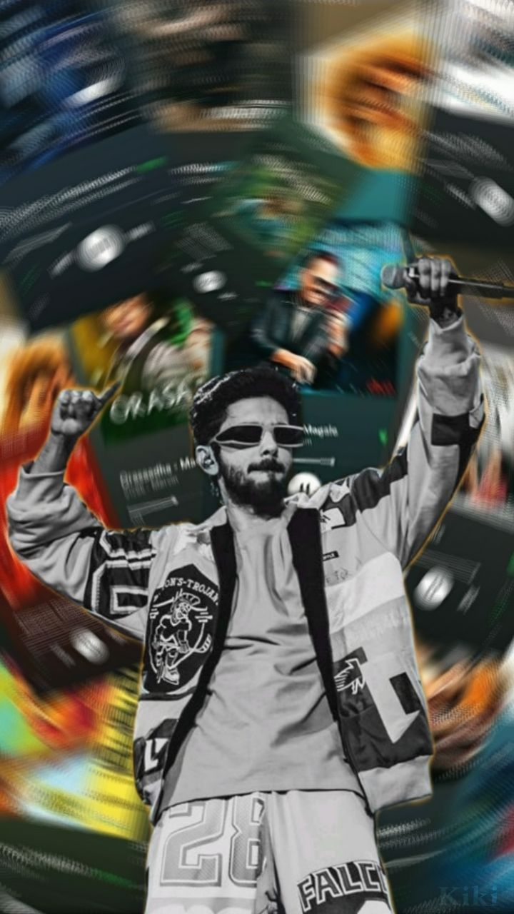

<div align="center">

<!-- Animated SVG Logo -->
<svg width="240" height="80" viewBox="0 0 240 80" xmlns="http://www.w3.org/2000/svg">
  <defs>
    <linearGradient id="g" x1="0%" y1="0%" x2="100%" y2="0%">
      <stop offset="0%" stop-color="#6c5ce7"/>
      <stop offset="50%" stop-color="#00d2ff"/>
      <stop offset="100%" stop-color="#ff6fd5"/>
    </linearGradient>
    <linearGradient id="g2" x1="0%" y1="0%" x2="100%" y2="0%">
      <stop offset="0%" stop-color="#d4a853"/>
      <stop offset="100%" stop-color="#f0d080"/>
    </linearGradient>
    <filter id="glow">
      <feGaussianBlur stdDeviation="2" result="blur"/>
      <feMerge><feMergeNode in="blur"/><feMergeNode in="SourceGraphic"/></feMerge>
    </filter>
  </defs>

  <!-- Morse animation -->
  <text x="120" y="24" text-anchor="middle" font-family="monospace" font-size="11" font-weight="bold" fill="url(#g2)" filter="url(#glow)">
    <animate attributeName="opacity" values="0.3;1;0.3" dur="2s" repeatCount="indefinite"/>
    ••- •-• •••- •-
  </text>

  <!-- Main title -->
  <text x="120" y="58" text-anchor="middle" font-family="'Orbitron',monospace" font-size="44" font-weight="700" fill="url(#g)" filter="url(#glow)">
    URVA
    <animate attributeName="opacity" values="0.85;1;0.85" dur="3s" repeatCount="indefinite"/>
  </text>

  <!-- Animated underline -->
  <line x1="60" y1="68" x2="180" y2="68" stroke="url(#g)" stroke-width="2" stroke-linecap="round">
    <animate attributeName="x1" values="60;100;60" dur="3s" repeatCount="indefinite"/>
    <animate attributeName="x2" values="180;140;180" dur="3s" repeatCount="indefinite"/>
    <animate attributeName="opacity" values="0.5;1;0.5" dur="3s" repeatCount="indefinite"/>
  </line>
</svg>

<br/>

<!-- Animated tagline -->
<pre style="font-family:'Orbitron',monospace;font-size:13px;color:#d4a853;letter-spacing:3px;background:transparent;border:none;">
✦ RETRO HI-FI MUSIC EXPERIENCE ✦
</pre>

<br/>

<!-- Badges with animation -->
<a href="https://github.com/Rizirfan/Urva"></a>
<a href="https://github.com/Rizirfan/Urva/blob/main/index.html"></a>
<a href="https://github.com/Rizirfan/Urva/blob/main/LICENSE"></a>
<a href="https://github.com/Rizirfan/Urva/stargazers"></a>
<a href="https://github.com/Rizirfan/Urva/forks"></a>

<br/><br/>

<!-- Animated demo screen recording - replace with actual screen recording when available -->


<br/><br/>

</div>

<!-- Animated Divider -->
<svg width="100%" height="40" viewBox="0 0 1200 40" preserveAspectRatio="none" xmlns="http://www.w3.org/2000/svg" style="display:block;margin:20px 0;">
  <defs>
    <linearGradient id="dg" x1="0%" y1="0%" x2="100%" y2="0%">
      <stop offset="0%" stop-color="transparent"/>
      <stop offset="20%" stop-color="#6c5ce7"/>
      <stop offset="50%" stop-color="#00d2ff"/>
      <stop offset="80%" stop-color="#ff6fd5"/>
      <stop offset="100%" stop-color="transparent"/>
    </linearGradient>
  </defs>
  <path d="M0,20 Q200,0 400,20 Q600,40 800,20 Q1000,0 1200,20" stroke="url(#dg)" stroke-width="2" fill="none" opacity="0.6">
    <animate attributeName="d" values="M0,20 Q200,0 400,20 Q600,40 800,20 Q1000,0 1200,20;M0,20 Q200,40 400,20 Q600,0 800,20 Q1000,40 1200,20;M0,20 Q200,0 400,20 Q600,40 800,20 Q1000,0 1200,20" dur="4s" repeatCount="indefinite"/>
    <animate attributeName="opacity" values="0.6;1;0.6" dur="3s" repeatCount="indefinite"/>
  </path>
</svg>

## ✨ Features

<div align="center">
<table>
<tr>
<td align="center" width="33%">
<b>🎵</b><br/>
<b>YouTube Integration</b><br/>
<sub>Search & play millions of songs via YouTube API with built-in player</sub>
</td>
<td align="center" width="33%">
<b>📻</b><br/>
<b>Realistic Hi-Fi Stack</b><br/>
<sub>CD player, tuner, EQ, amp, cassette deck — all fully interactive</sub>
</td>
<td align="center" width="33%">
<b>💡</b><br/>
<b>Interactive Lights</b><br/>
<sub>Physics-based fairy lights with rope simulation & drag interaction</sub>
</td>
</tr>
<tr>
<td align="center" width="33%">
<b>🎚️</b><br/>
<b>Visualizers</b><br/>
<sub>VU meters, EQ bars & speaker cones pulse to synthesized music signals</sub>
</td>
<td align="center" width="33%">
<b>🌙</b><br/>
<b>Ambient Modes</b><br/>
<sub>Dark room mode, decoration lights, and power toggle for immersive vibe</sub>
</td>
<td align="center" width="33%">
<b>🎨</b><br/>
<b>Custom Posters</b><br/>
<sub>Edit wall posters — change names, subtitles & upload custom images</sub>
</td>
</tr>
<tr>
<td align="center" width="33%">
<b>🔊</b><br/>
<b>Sound Effects</b><br/>
<sub>Retro click, switch, knob & transport sounds via Web Audio API</sub>
</td>
<td align="center" width="33%">
<b>📱</b><br/>
<b>Fully Responsive</b><br/>
<sub>Works beautifully on desktop, tablet & mobile with adaptive layout</sub>
</td>
<td align="center" width="33%">
<b>⌨️</b><br/>
<b>Keyboard Shortcuts</b><br/>
<sub>Space, arrows, N/P for next/prev — full keyboard control</sub>
</td>
</tr>
</table>
</div>

<!-- Animated Divider -->
<svg width="100%" height="30" viewBox="0 0 1200 30" preserveAspectRatio="none" xmlns="http://www.w3.org/2000/svg" style="display:block;margin:20px 0;">
  <defs>
    <linearGradient id="dg2" x1="0%" y1="0%" x2="100%" y2="0%">
      <stop offset="0%" stop-color="transparent"/>
      <stop offset="30%" stop-color="#d4a853"/>
      <stop offset="70%" stop-color="#f0d080"/>
      <stop offset="100%" stop-color="transparent"/>
    </linearGradient>
  </defs>
  <path d="M0,15 Q300,30 600,15 Q900,0 1200,15" stroke="url(#dg2)" stroke-width="1.5" fill="none" opacity="0.4">
    <animate attributeName="d" values="M0,15 Q300,0 600,15 Q900,30 1200,15;M0,15 Q300,30 600,15 Q900,0 1200,15;M0,15 Q300,0 600,15 Q900,30 1200,15" dur="5s" repeatCount="indefinite"/>
  </path>
</svg>

## 🚀 Getting Started

### Prerequisites
- A modern web browser (Chrome, Firefox, Safari, Edge)
- A [YouTube Data API v3 key](https://console.cloud.google.com/apis/credentials) (for search functionality)

### Usage

1. **Clone the repo**
   ```bash
   git clone https://github.com/Rizirfan/Urva.git
   cd Urva
   ```

2. **Open `index.html`** in your browser — no build tools required!

3. **Set up API key** (optional — for YouTube search)
   - Click the ⚙️ Settings button in the navbar
   - Paste your YouTube Data API v3 key
   - Save and start searching

4. **Enjoy!** Browse music, tweak the knobs, and toggle the lights.

### Keyboard Controls

| Key | Action |
|-----|--------|
| `Space` | Play / Pause |
| `→` / `←` | Seek forward / back 5s |
| `↑` / `↓` | Volume up / down |
| `N` / `P` | Next / Previous track |
| `Esc` | Close playlist drawer |

<!-- Animated Divider -->
<svg width="100%" height="30" viewBox="0 0 1200 30" preserveAspectRatio="none" xmlns="http://www.w3.org/2000/svg" style="display:block;margin:20px 0;">
  <defs>
    <linearGradient id="dg3" x1="0%" y1="0%" x2="100%" y2="0%">
      <stop offset="0%" stop-color="transparent"/>
      <stop offset="30%" stop-color="#ff6fd5"/>
      <stop offset="70%" stop-color="#6c5ce7"/>
      <stop offset="100%" stop-color="transparent"/>
    </linearGradient>
  </defs>
  <path d="M0,15 Q200,0 400,15 Q600,30 800,15 Q1000,0 1200,15" stroke="url(#dg3)" stroke-width="2" fill="none" opacity="0.5">
    <animate attributeName="d" values="M0,15 Q200,30 400,15 Q600,0 800,15 Q1000,30 1200,15;M0,15 Q200,0 400,15 Q600,30 800,15 Q1000,0 1200,15;M0,15 Q200,30 400,15 Q600,0 800,15 Q1000,30 1200,15" dur="6s" repeatCount="indefinite"/>
    <animate attributeName="opacity" values="0.5;0.8;0.5" dur="4s" repeatCount="indefinite"/>
  </path>
</svg>

## 🎛️ Hi-Fi Stack

```
┌──────────────────────────────────────────────────┐
│  🎵  CD Player  ──  Spinning disc & VFD display │
│  📡  Tuner      ──  Analog dial with needle     │
│  📊  Equalizer  ──  15-band animated LED bars    │
│  🔊  Amplifier  ──  Volume knob & VU meters     │
│  📼  Cassette   ──  Dual deck with spinning     │
│       Deck           reels & transport controls  │
│  🎮  Controls   ──  Shuffle, repeat, mute,      │
│                       volume fader & progress bar│
└──────────────────────────────────────────────────┘
```

## 🖼️ Wall of Legends

The room features posters of legendary Tamil music directors:

| Poster | Name | Moniker |
|--------|------|---------|
|  | **A.R. Rahman** | *Mozart of Madras* |
|  | **Ilaiyaraaja** | *Isaignani* |
|  | **Harris Jayaraj** | *The Melody King* |
|  | **Yuvan Shankar Raja** | *Little Maestro* |
|  | **Anirudh Ravichander** | *Rockstar* |
|  | **Santhosh Narayanan** | *Indie Beats* |

Click any poster to customize the name, subtitle, or image!

<!-- Animated Divider -->
<svg width="100%" height="30" viewBox="0 0 1200 30" preserveAspectRatio="none" xmlns="http://www.w3.org/2000/svg" style="display:block;margin:20px 0;">
  <defs>
    <linearGradient id="dg4" x1="0%" y1="0%" x2="100%" y2="0%">
      <stop offset="0%" stop-color="transparent"/>
      <stop offset="30%" stop-color="#00d2ff"/>
      <stop offset="70%" stop-color="#7a5cff"/>
      <stop offset="100%" stop-color="transparent"/>
    </linearGradient>
  </defs>
  <path d="M0,15 Q400,0 800,15 Q1000,30 1200,15" stroke="url(#dg4)" stroke-width="1.5" fill="none" opacity="0.4" stroke-dasharray="4 4">
    <animate attributeName="stroke-dashoffset" values="0;-20" dur="2s" repeatCount="indefinite"/>
  </path>
</svg>

## 🛠️ Built With

<div align="center">

| Technology | Purpose |
|------------|---------|
|  | Structure & semantics |
|  | Styling, animations, glassmorphism, 3D transforms |
|  | Logic, YouTube API, Web Audio, Canvas physics |
|  | Music search & playback |
|  | SFX generation |
|  | Fairy lights rope physics & rendering |

</div>

<!-- Animated Divider -->
<svg width="100%" height="30" viewBox="0 0 1200 30" preserveAspectRatio="none" xmlns="http://www.w3.org/2000/svg" style="display:block;margin:20px 0;">
  <defs>
    <linearGradient id="dg5" x1="0%" y1="0%" x2="100%" y2="0%">
      <stop offset="0%" stop-color="transparent"/>
      <stop offset="30%" stop-color="#ff6fd5"/>
      <stop offset="70%" stop-color="#00d2ff"/>
      <stop offset="100%" stop-color="transparent"/>
    </linearGradient>
  </defs>
  <circle cx="0" cy="15" r="4" fill="url(#dg5)" opacity="0.6">
    <animateMotion dur="4s" repeatCount="indefinite" path="M0,0 Q300,-20 600,0 Q900,20 1200,0"/>
  </circle>
</svg>

## 📸 Screenshots

<div align="center">
<table>
<tr>
<td align="center"></td>
<td align="center"></td>
</tr>
<tr>
<td align="center"><b>Full Hi-Fi Stack</b></td>
<td align="center"><b>Dark Room Ambient Mode</b></td>
</tr>
<tr>
<td align="center"></td>
<td align="center"></td>
</tr>
<tr>
<td align="center"><b>Interactive Fairy Lights</b></td>
<td align="center"><b>Playlist Drawer</b></td>
</tr>
</table>
</div>

> **📌 Note:** Add actual screenshots by taking captures of the app and placing them in the `assets/` folder, then update the `src` URLs above.

<!-- Animated Divider -->
<svg width="100%" height="30" viewBox="0 0 1200 30" preserveAspectRatio="none" xmlns="http://www.w3.org/2000/svg" style="display:block;margin:20px 0;">
  <defs>
    <linearGradient id="dg6" x1="0%" y1="0%" x2="100%" y2="0%">
      <stop offset="0%" stop-color="transparent"/>
      <stop offset="50%" stop-color="#d4a853"/>
      <stop offset="100%" stop-color="transparent"/>
    </linearGradient>
  </defs>
  <path d="M0,15 Q300,0 600,15 Q900,30 1200,15" stroke="url(#dg6)" stroke-width="1" fill="none" opacity="0.3">
    <animate attributeName="d" values="M0,15 Q200,5 400,15 Q600,25 800,15 Q1000,5 1200,15;M0,15 Q200,25 400,15 Q600,5 800,15 Q1000,25 1200,15;M0,15 Q200,5 400,15 Q600,25 800,15 Q1000,5 1200,15" dur="3s" repeatCount="indefinite"/>
  </path>
</svg>

## 🤝 Contributing

Contributions are welcome! Feel free to:

- 🐛 Report bugs via [Issues](https://github.com/Rizirfan/Urva/issues)
- 💡 Suggest features via [Pull Requests](https://github.com/Rizirfan/Urva/pulls)
- ⭐ Star the repo if you like it!

## 📄 License

This project is open source and available under the **MIT License**.

---

<div align="center">

<sub>Made with ❤️ by [Rizirfan](https://github.com/Rizirfan)</sub>

<br/>

<!-- Animated footer -->
<svg width="200" height="24" viewBox="0 0 200 24" xmlns="http://www.w3.org/2000/svg">
  <defs>
    <linearGradient id="fg" x1="0%" y1="0%" x2="100%" y2="0%">
      <stop offset="0%" stop-color="#6c5ce7"/>
      <stop offset="50%" stop-color="#00d2ff"/>
      <stop offset="100%" stop-color="#ff6fd5"/>
    </linearGradient>
  </defs>
  <text x="100" y="18" text-anchor="middle" font-family="monospace" font-size="13" fill="url(#fg)" opacity="0.7">
    ♫ turn it up ♫
    <animate attributeName="opacity" values="0.4;0.8;0.4" dur="2.5s" repeatCount="indefinite"/>
  </text>
</svg>

</div>
